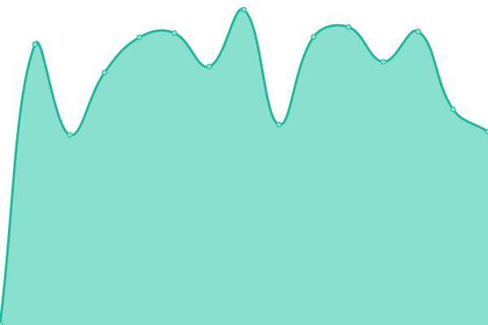
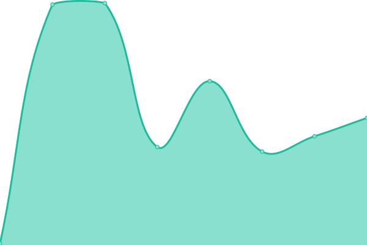

# [📈 Live Status](https://status.pastis-hosting.net): <!--live status--> **🟧 Partial outage**

This repository contains the open-source uptime monitor and status page for [pastis-hsto](https://status.pastis-hosting.net), powered by [Upptime](https://github.com/upptime/upptime).

With [Upptime](https://upptime.js.org), you can get your own unlimited and free uptime monitor and status page, powered entirely by a GitHub repository. We use [Issues](https://github.com/pastis-hsto/status/issues) as incident reports, [Actions](https://github.com/pastis-hsto/status/actions) as uptime monitors, and [Pages](https://status.pastis-hosting.net) for the status page.

<!--start: status pages-->
<!-- This summary is generated by Upptime (https://github.com/upptime/upptime) -->
<!-- Do not edit this manually, your changes will be overwritten -->
<!-- prettier-ignore -->
| URL | Status | History | Response Time | Uptime |
| --- | ------ | ------- | ------------- | ------ |
|  [argocd](https://argocd.pastis-hosting.net) | 🟥 Down | [argocd.yml](https://github.com/pastis-hosting/status/commits/HEAD/history/argocd.yml) | 

 502ms
     
 | 

<a href="https://status.pastis-hosting.net/history/argocd">2.56%</a>
    

|  [keycloak](https://keycloak.pastis-hosting.net) | 🟩 Up | [keycloak.yml](https://github.com/pastis-hosting/status/commits/HEAD/history/keycloak.yml) | 

 809ms
     
 | 

<a href="https://status.pastis-hosting.net/history/keycloak">62.13%</a>
    

|  [status](https://status.pastis-hosting.net) | 🟩 Up | [status.yml](https://github.com/pastis-hosting/status/commits/HEAD/history/status.yml) | 

 148ms
     
 | 

<a href="https://status.pastis-hosting.net/history/status">0.00%</a>
    

|  [www](https://www.pastis-hosting.net) | 🟩 Up | [www.yml](https://github.com/pastis-hosting/status/commits/HEAD/history/www.yml) | 

 880ms
     
 | 

<a href="https://status.pastis-hosting.net/history/www">61.44%</a>
    

<!--end: status pages-->

[**Visit our status website →**](https://status.pastis-hosting.net)

## 📄 License

- Powered by: [Upptime](https://github.com/upptime/upptime)
- Code: [MIT](./LICENSE) © [pastis-hsto](https://status.pastis-hosting.net)
- Data in the `./history` directory: [Open Database License](https://opendatacommons.org/licenses/odbl/1-0/)
